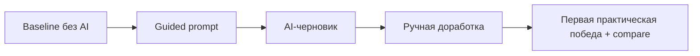
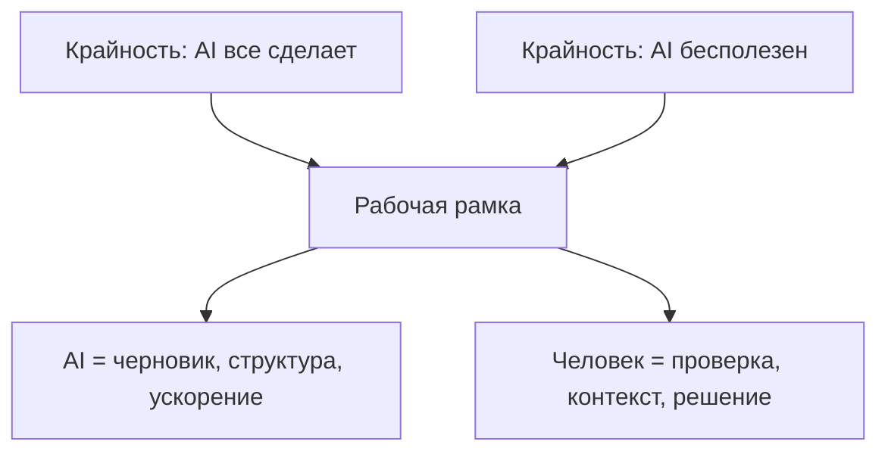
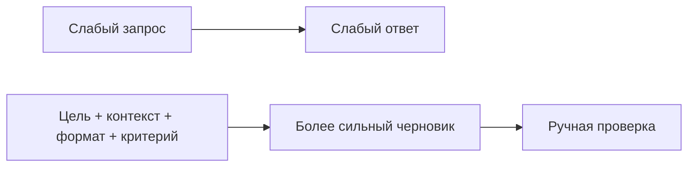
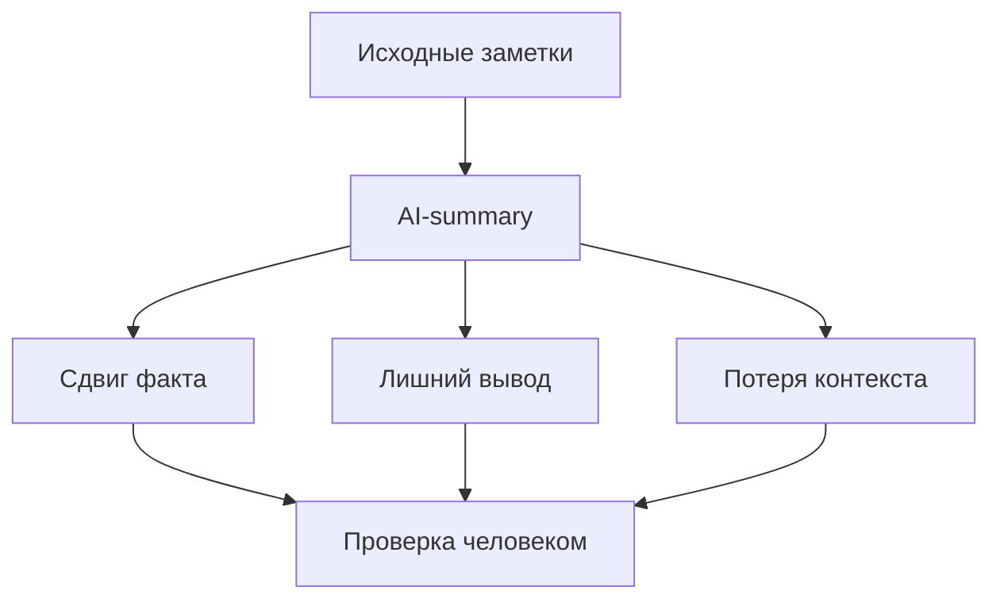
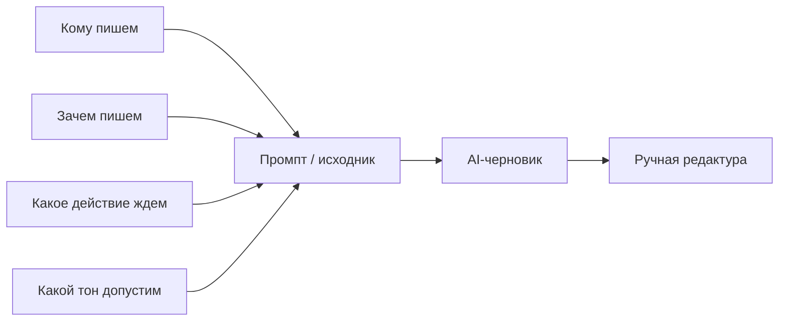
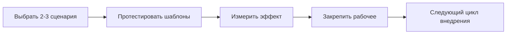

# First Wave Diagrams

Дата: 20 марта 2026
Статус: мермайд-схемы для первой волны

Эти схемы можно использовать как:
- основу для SVG-перерисовки;
- быстрый visual appendix к уроку;
- источник для отдельных process-slides.

## Сессия 0

## Урок 1

## Урок 5

## Урок 11

## Урок 16

## Урок 24

