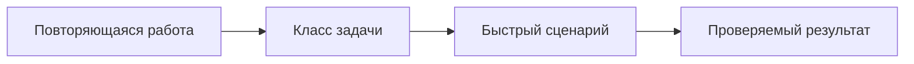
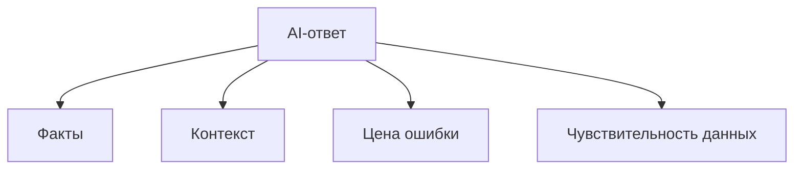
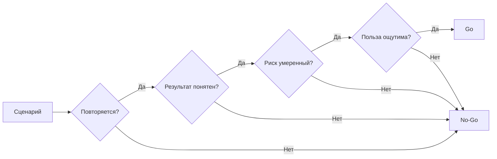

# Wave 1B Diagrams

Дата: 21 марта 2026
Статус: Mermaid-схемы для уроков 2-4

## Урок 2. От карты задач к первым классам

```mermaid
flowchart LR
    A["Повторяющаяся работа"] --> B["Класс задачи"]
    B --> C["Быстрый сценарий"]
    C --> D["Проверяемый результат"]
```

## Урок 3. Линзы риска

```mermaid
flowchart TD
    A["AI-ответ"] --> B["Факты"]
    A --> C["Контекст"]
    A --> D["Цена ошибки"]
    A --> E["Чувствительность данных"]
```

## Урок 4. Go / No-Go filter

```mermaid
flowchart LR
    A["Сценарий"] --> B{"Повторяется?"}
    B -->|Да| C{"Результат понятен?"}
    B -->|Нет| X["No-Go"]
    C -->|Да| D{"Риск умеренный?"}
    C -->|Нет| X
    D -->|Да| E{"Польза ощутима?"}
    D -->|Нет| X
    E -->|Да| F["Go"]
    E -->|Нет| X
```
