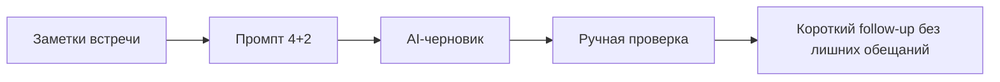
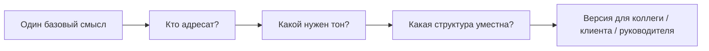
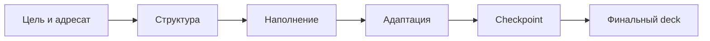
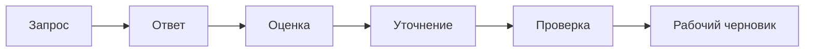
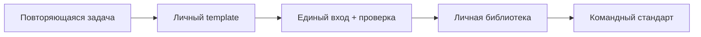

# Wave 2 Diagrams

Дата: 21 марта 2026
Статус: mermaid-схемы для уроков 6-10

Эти схемы можно использовать как:
- основу для SVG-перерисовки;
- быстрый visual appendix к урокам 6-10;
- источник для workflow и bridge screens.

## Урок 6

## Урок 7

## Урок 8

## Урок 9

## Урок 10

