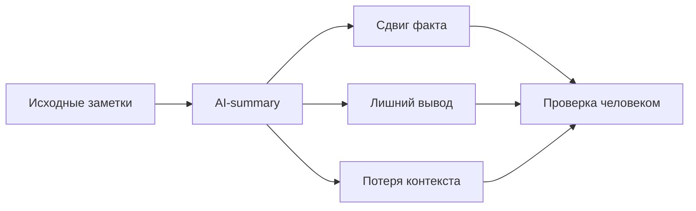
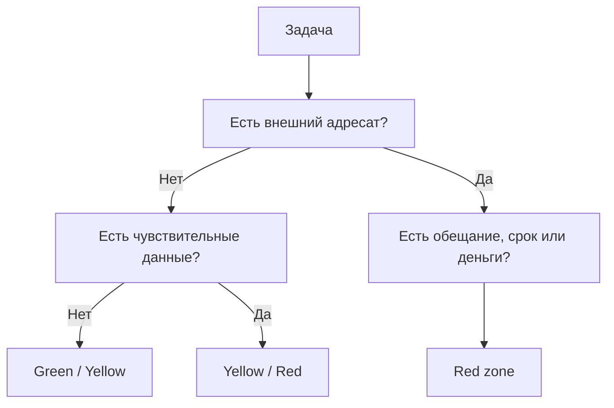
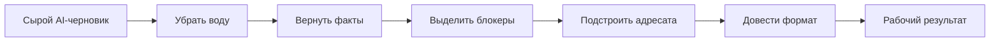
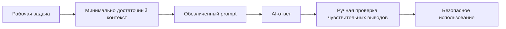

# Wave 2B Diagrams

Дата: 21 марта 2026
Статус: Mermaid-схемы для уроков 11-15

Эти схемы можно использовать как:
- основу для SVG-перерисовки;
- быстрый visual appendix к уроку;
- source logic для записи и черновой монтаж.

## Урок 11

## Урок 12

## Урок 13

## Урок 14

## Урок 15

