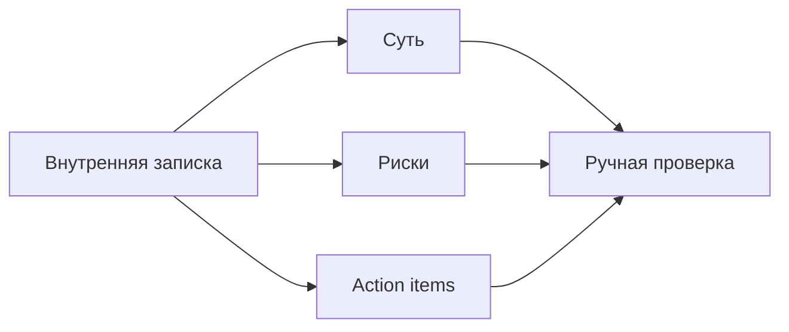
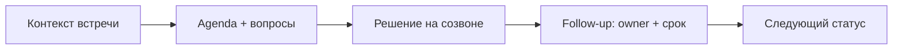
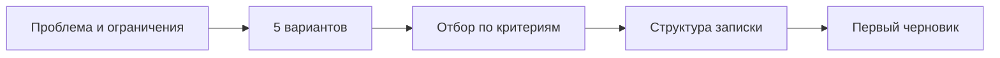
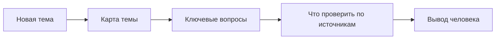
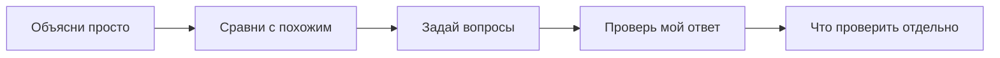
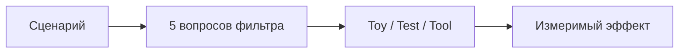
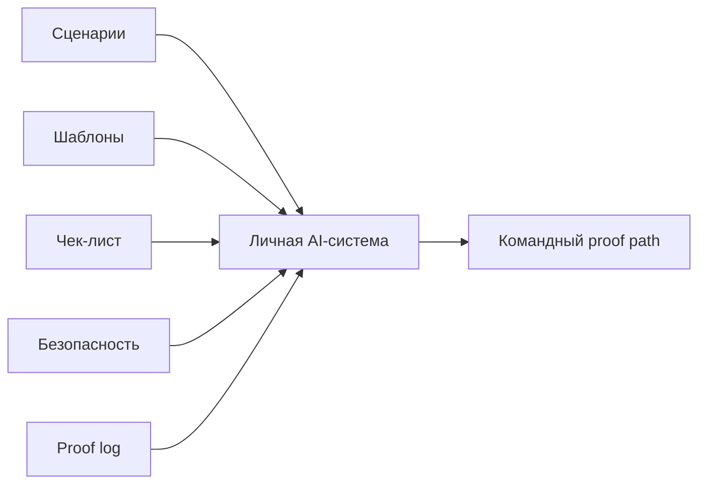
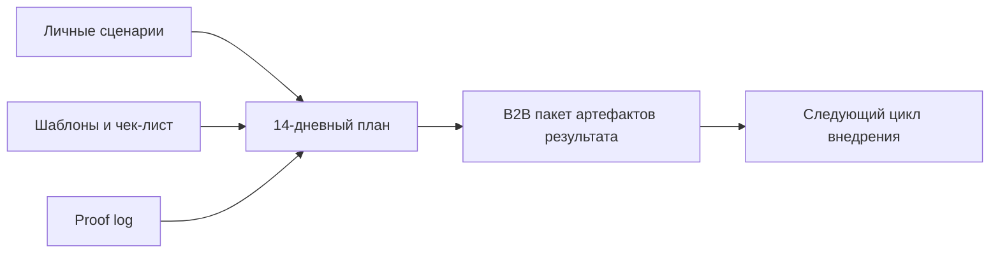

# Wave 3 Diagrams

Дата: 21 марта 2026
Статус: Mermaid-схемы для уроков 17-24

Эти схемы можно использовать как:
- основу для SVG-перерисовки;
- быстрый visual appendix к уроку;
- источник для отдельных process-slides и черновой монтаж.

## Урок 17

## Урок 18

## Урок 19

## Урок 20

## Урок 21

## Урок 22

## Урок 23

## Урок 24

